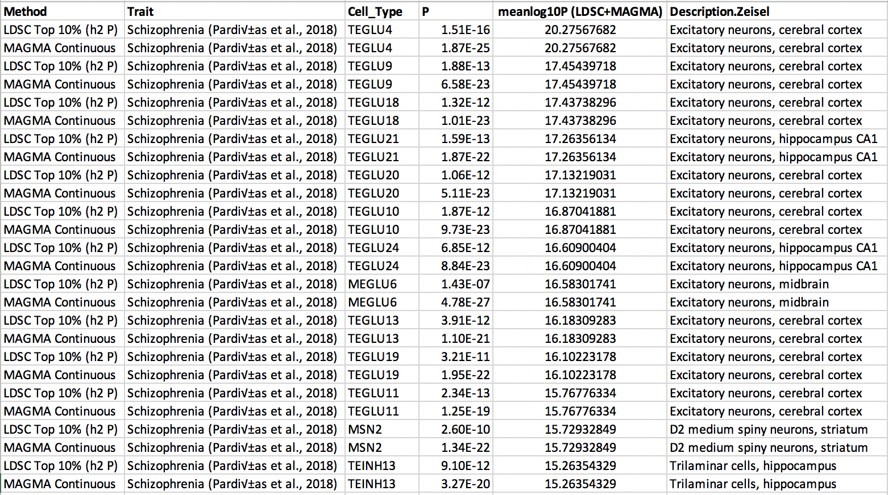

Our [https://www.biorxiv.org/content/10.1101/528463v1](latest preprint) on cell type mapping is now available on bioRxiv. This work was a collaboration with the Hjerling-Leffler and Sullivan labs. Some of the most exciting findings relate to Parkinson's disease: we discover genetic associations with most the celltypes known to degenerate in the disease (suggesting this occurs cell autonomously) but also discovered a new link to Oligodendrocytes.

We tested for associations with 231 cell types from the mouse central, peripheral and enteric nervous systems. We used single cell transcriptome data from @slinnarsson recent [https://is.gd/TDuwm7](cell type atlas).

As in our previous paper (https://is.gd/Vwval4 ) we used two distinct methods: MAGMA tested for a positive relationship between gene specificity and gene-level genetic associations; LDSC tested if the 10% most specific genes in a cell are enriched for trait heritability.

As with our previous schizophrenia findings, the strongest signals were in cortical + CA1 pyramidal neurons, D2 medium spiny neurons, and Reln/Ndnf expressing interneurons. Importantly however, we also found another strongly enriched cell type in the superior colliculus (MEGLU6)

Excitatory neurons from cortical layer 5 (TEGLU4) project to the superior colliculus and to the striatum. MEGLU6 is located in the superior colliculus, while MSN2 is located in the striatum. This may imply a circuit between these cell types may be disrupted in schizophrenia.

As before, we did not observe any significant associations with immune or vascular cells for schizophrenia nor any other psychiatric disorders or cognitive traits.

BMI had strongest associations with neurons in the midbrain (MEGLU10), hypothalamus (DEINH3) and solitary nucleus (HBGLU3). The hypothalamus is plays a major role in weight regulation, and the solitary nucleus is involved in gustatory processing and projects to the hypothalamus

Stroke and migraine were significantly associated with arterial smooth muscle cells (VSMCA), indicating that vascular process play a central role in these traits.

Thanks to @23andMeResearch we were able to analyse a new Parkinsons GWAS (12,657 cases, 941,588 controls). We meta-analysed this with an existing PD GWAS (9,581 cases, 33,245 controls). This was exciting as the hallmark sign of PD is degeneration of a specific cell type.

The degenerating cells (MBDOP2) were highly associated with the PD common variants. Strikingly, other cell types which degenerate in PD also showed strong associations, including serotonergic raphe nucleus neurons (HBSER2) and cholinergic neurons of the Pons (HBCHO2)

While the neuronal associations with PD confirmed our expectations, we also found strong association with the oligodendrocyte lineage (NFOL2, MFOL1, COP1, NFOL1, MOL1, MFOL2, COP2, MOL2) which was totally unexpected.

We tested if the oligodendrocyte lineage cells shared a common genetic disease mechanism with the neuronal cell types, using a conditional enrichment approach. While the neurons (i.e. MBDOP2 and HBSER2) shared mechanisms together, this did not overlap with oligodendrocytes.

Our results suggest that shared biological mechanisms intrinsic to MBDOP2 and HBSER2 neuronal cell types lead to their selective loss in Parkinsons disease. They also indicate that a separate and hitherto unknown disease mechanisms exists involving oligodendrocytes.

Struck by the novelty of this link between Parkinsons and Oligodendrocyte lineage cells we set out to establish if further evidence would either support or refute this.

We used EWCE to find which cell types are enriched for genes with rare variants associated with Parkinsonism. MBDOP2 were the most significantly enriched (p<0.0001/231). We did not observe any significant enrichments in oligodendrocyte lineage for these rare variants.

This potentially indicates a difference between the common and rare variant forms of Parkinsons, or that the Parkinsonism associated variants are more directly related only to the prominent symptoms (note Parkinsonism!=Parkinsons).

We then used EWCE to find cell types altered in human post-mortem Parkinson’s disease brain. In three seperate studies, downregulated genes were specifically enriched in dopaminergic neurons, while upregulated genes were significantly enriched in oligodendrocyte lineage cells.

We then analysed data from post-mortem human brains which had been scored by neuropathologists for their Braak stage. This showed that upregulation of oligodendrocyte genes is already found at Braak stage 1/2 which precedes dopaminergic neuron downregulation and degeneration.

These results not only support the genetic evidence indicating that oligodendrocytes may play a causal role in Parkinson’s disease, but indicate that their involvement precedes the emergence of pathological changes in neurons of the substantia nigra.
