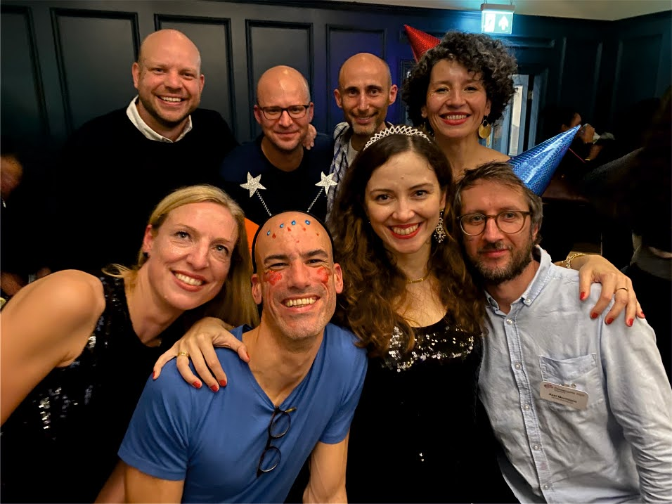
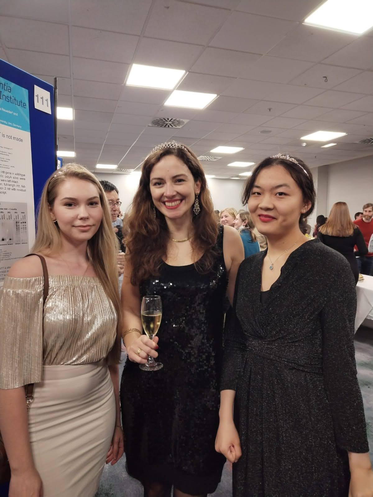
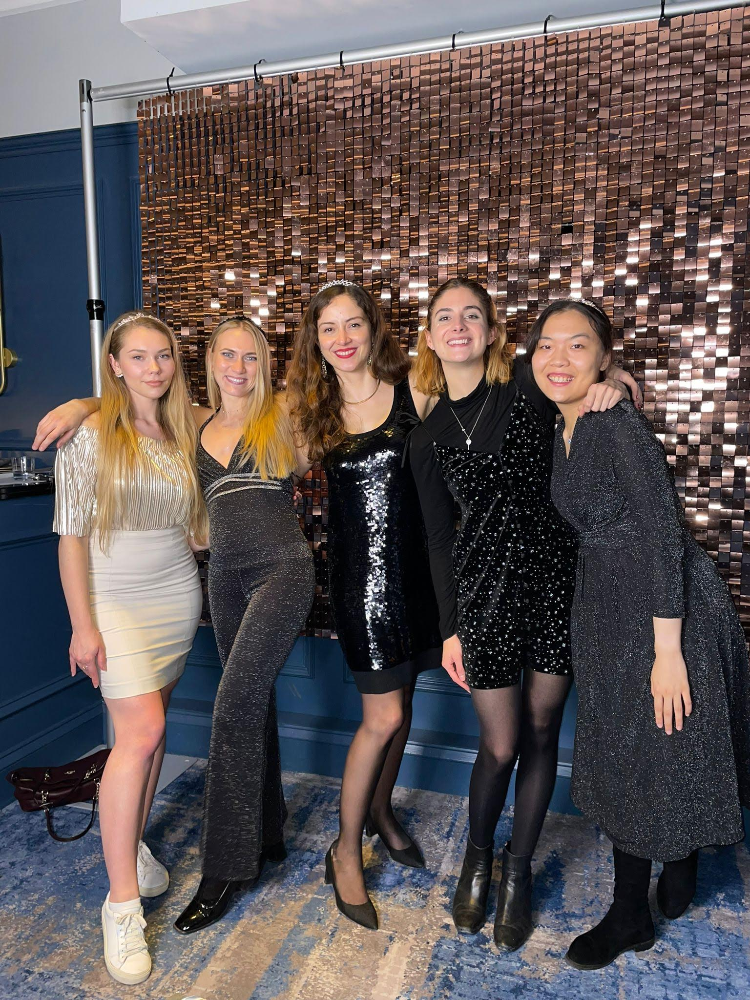
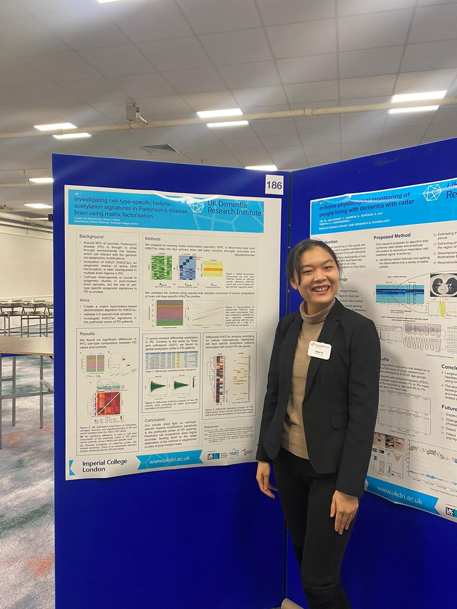
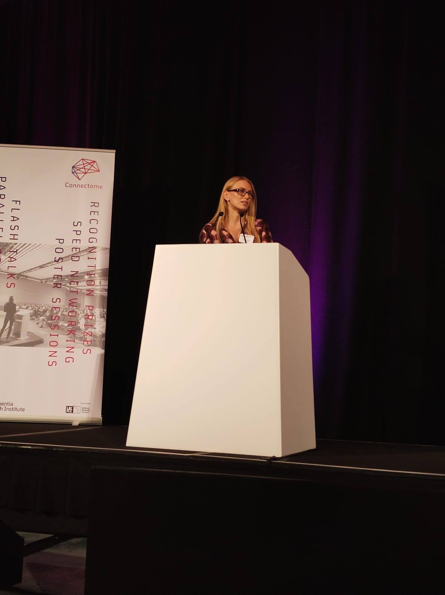
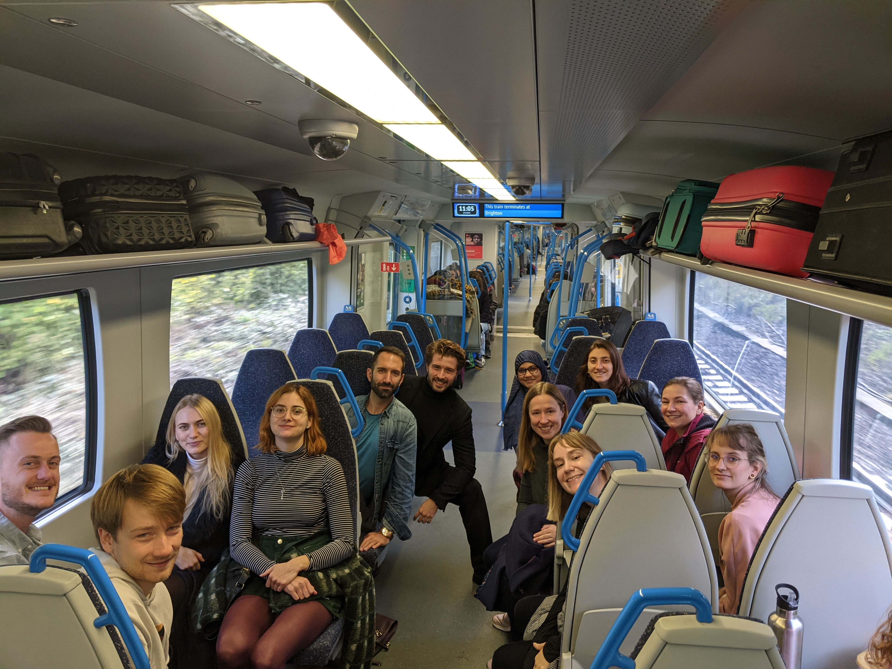
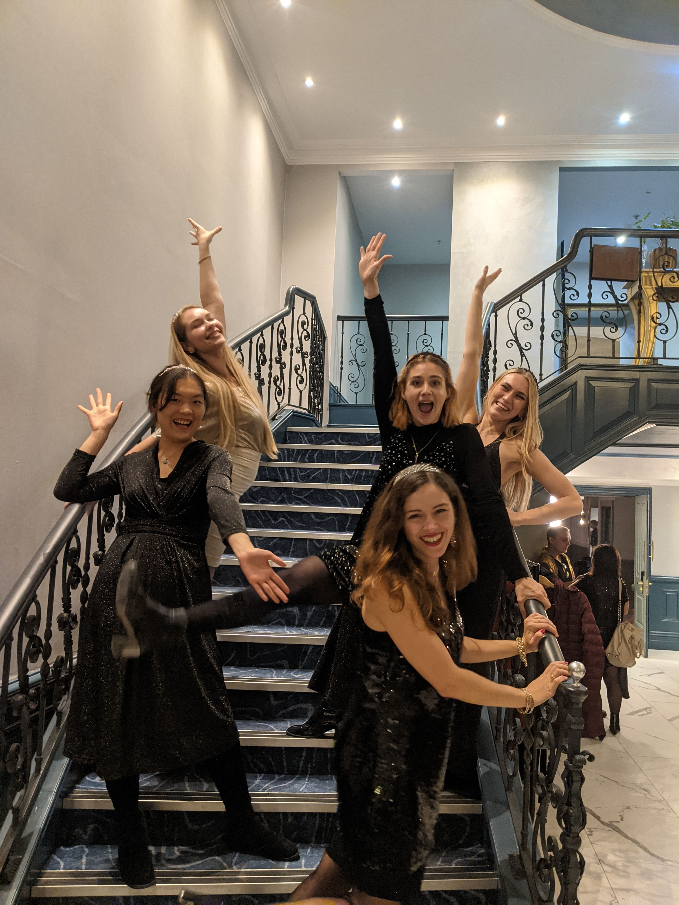
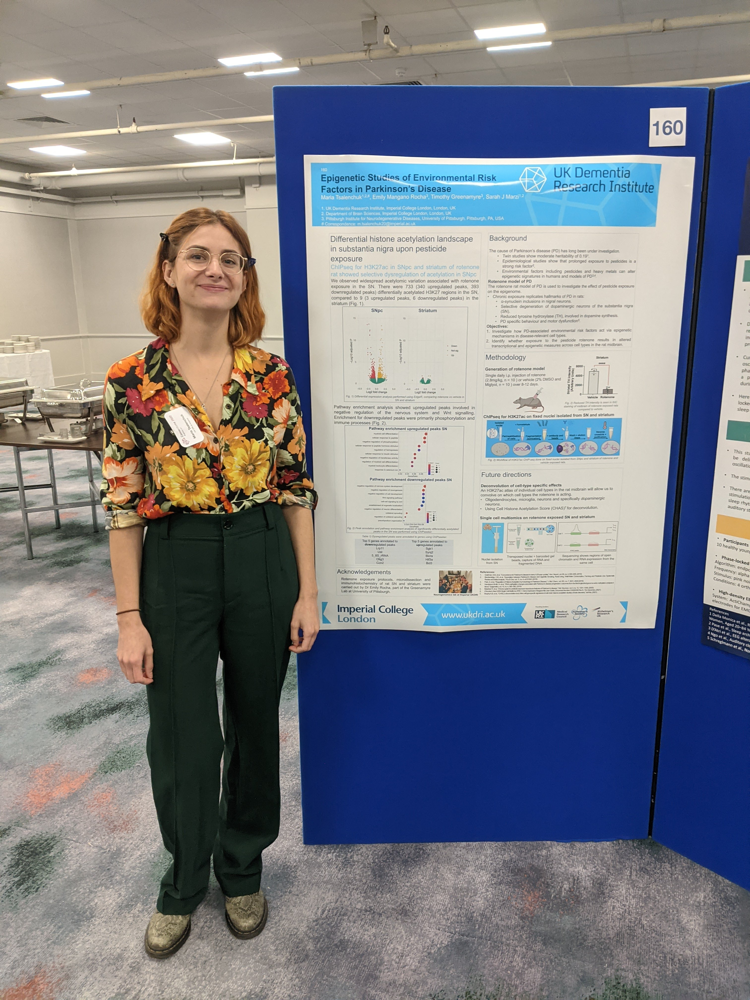
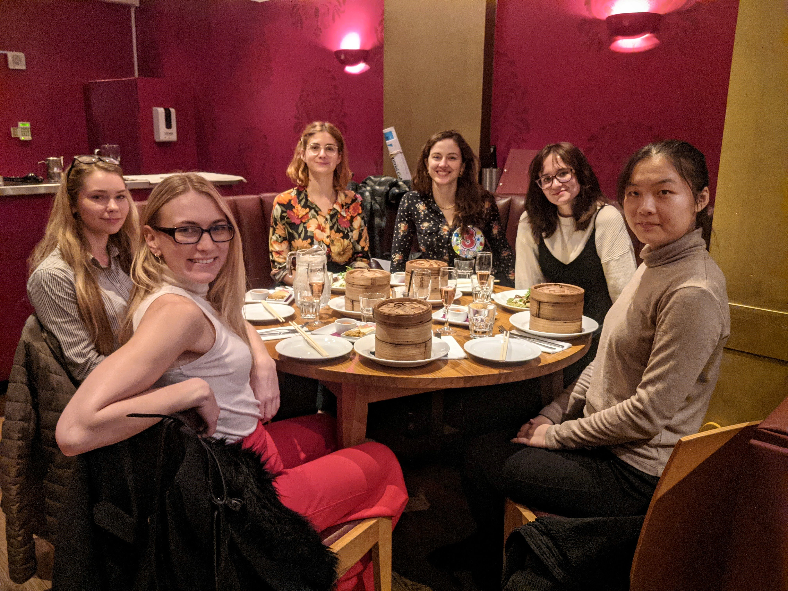

Connectome is a yearly conference for all members of the UK DRI network, and this year it took place in Brighton. The lab travelled to Brighton together on Wednesday 2 to join the ECR Day which included multiple sessions on leadership, careers, and science. Connectome had a full schedule of networking, poster sessions, lectures, and socializing, and the members of the UK DRI network accross all member universities got to share their work with each other and find potential collaborators. There was also a 5-year birtday party for the UK DRI and as the photos from the event suggest, the theme was glitter!

